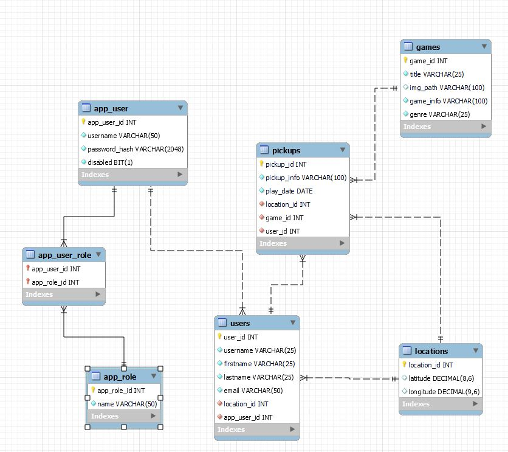

# PickUpPlay

## Description

+ This app will help users find pickup games (games where anyone is welcome is join), either by searching by location, 
or by searching by what game they want to play.

+ Authenticated users will be able to search for pickups by a number of criteria, be it location, game, level of play, etc.,
as well as look through the game library with descriptions and details about the games they might want to play. 
They can also select games or pickups as favorites, and view a list of said favorites.

+ An admin will be able to create, update, and delete pickups and games.

## Task List

| Task                                  | Estimated Time (hrs) | Status      | Who Working On It |
|---------------------------------------|----------------------|-------------|-------------------|
| Database directories                  | .5                   | Done        | Both              |
| DDL: User and Location                | .5                   | Done        | Both              |
| DDL: PickUp and Game                  | 2                    | Done        | Both              |
| DML: Test Data                        | 2                    | Done        | Both              |
| ---BACKEND---                         |                      |             |                   |
| Models:                               |                      | Done        |                   |
| - User                                | 1                    | Done        | Ethan             |
| - Location                            | 1                    | Done        | Ethan             |
| - PickUp                              | 1                    | Done        | Nick              |
| - Game                                | 1                    | Done        | Nick              |
| Data Layer (Repos and JdbcTemplates): |                      |             |                   |
| - User                                | 2                    | Done        | Ethan             |
| - Location                            | 1                    | Done        | Ethan             |
| - PickUp                              |                      | Done        | Nick              |
| -- findById                           | 1                    | Done        |                   |
| -- findByGame                         | 1                    | Done        |                   |
| -- createPickUp                       | 1                    | Done        |                   |
| -- editPickUp                         | 1                    | Done        |                   |
| -- deletePickUp                       | 1                    | Done        |                   |
| - Game                                |                      | Done        | Nick              |
| -- findById                           | 1                    | Done        |                   |
| -- findByGenre                        | 1                    | Done        |                   |
| - Testing                             | 3                    | Done        | Both              |
| Domain Layer (Services):              |                      |             |                   |
| - Result and Validations              | 3                    | Done        | Both              |
| - User                                | 2                    | Done        | Ethan             |
| - Location                            | 2                    | Done        | Ethan             |
| - PickUp                              | 3                    | Done        | Nick              |
| - Game                                | 2                    | Done        | Nick              |
| - Testing                             | 3                    | Done        | Both              |
| Controllers:                          |                      |             |                   |
| - User                                | 1                    | Done        | Ethan             |
| - Location                            | 1                    | Done        | Ethan             |
| - PickUp                              | 3                    | Done        | Nick              |
| - Game                                | 1                    | Done        | Nick              |
| ---FRONTEND---                        |                      |             |                   |
| Create React App                      | 1                    | Done        | Both              |
| Components                            | 3                    | In Progress | Both              |
| Roles and Authentication              | 3                    | In Progress | Both              |
| GoogleMaps API                        | 4                    | Not Started | Both              |
| View PickUps                          | 2                    | Not Started | Both              |
| Add PickUp                            | 2                    | Not Started | Both              |
| Update PickUp                         | 2                    | Not Started | Both              |
| Delete PickUp                         | 2                    | Not Started | Both              |
| Game List                             | 2                    | Done        | Both              |
| View Games                            | 2                    | Done        | Both              |
| Debugging                             | 3                    | Not Started | Both              |
| Styling                               | 3                    | Not Started | Both              |
| Static Pages (Home, About, etc)       | 1                    | Not Started | Both              |

## Schema Diagram

